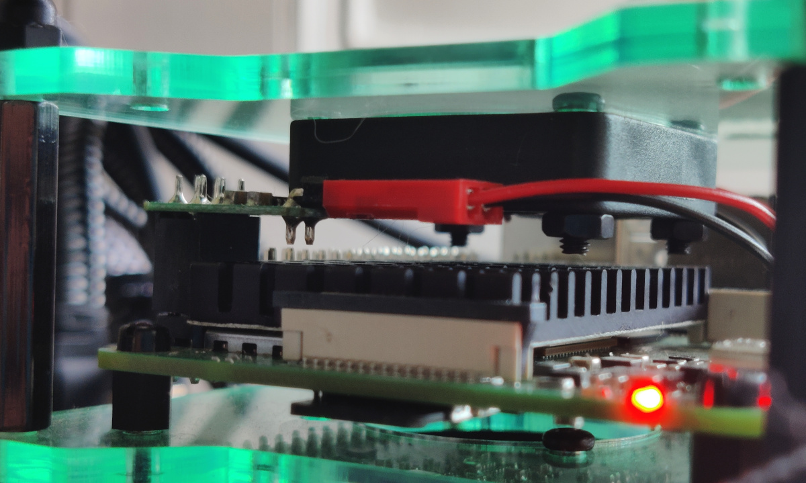
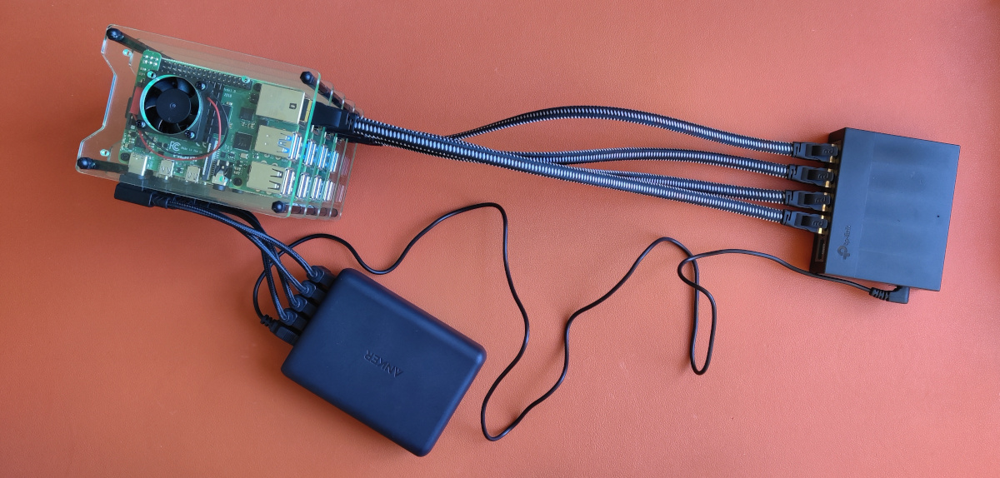
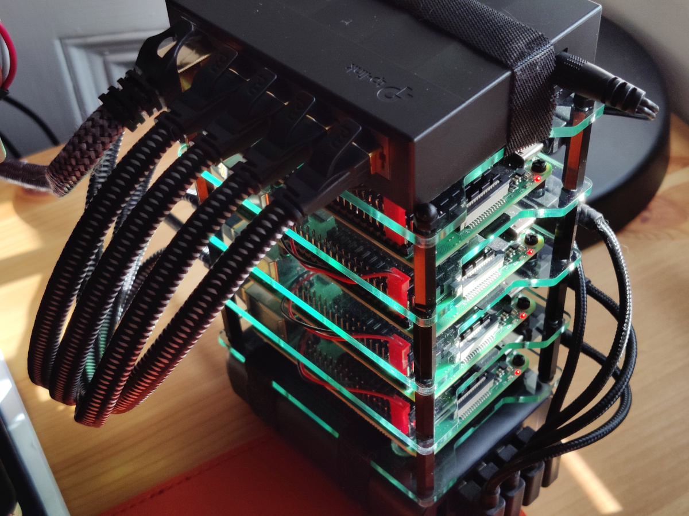
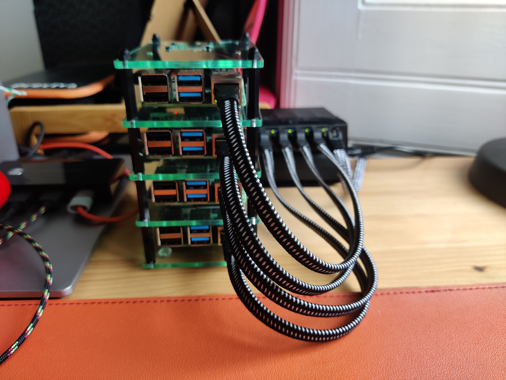
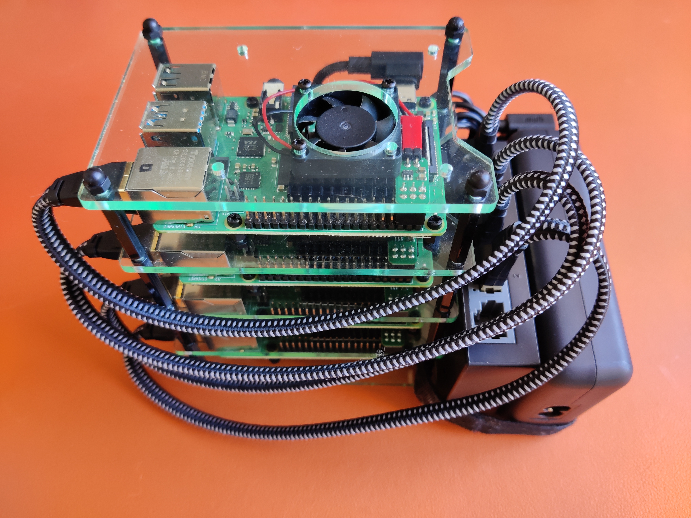

The setup assumes a four node cluster, but it is not a requirement.
Four is just a nice number of Raspberry Pi's. If you would like to make a bigger of smaller cluster, it is quite easy to adapt. After all, we're building a Kubernetes cluster and it should be scalable.

## Essential components

The minimal list of components is as follows:

* Computer that you will use to manage the Pis from. We're not connecting the cluster to any screens or keyboards. Any old PC/laptop will do, but it is much easier from Linux or Mac.

* Raspberry Pis, of course -- those should be 3B or later. I use 4x [RPi 4B with 4Gb of RAM](https://thepihut.com/products/raspberry-pi-4-model-b?variant=20064052740158) and it seems plenty. You can also mix and match, but you will want at least your master node to have plenty of memory.

* [16Gb+ Micro SD cards](https://thepihut.com/products/sandisk-microsd-card-class-10-a1?variant=39641172345027) -- one for each Pi -- you will install the OS on those. Performance of SD cards is quite poor in general, but it will do for starters as it's easiery and cheaper. There are ways to boot the OS off an SSD, but it is out of scope for now.

* [Micro SD card reader](https://thepihut.com/products/integral-micro-sd-card-reader) to connect to your computer, unless you have one built in already.

* [Unmanaged switch](https://www.amazon.co.uk/gp/product/B07VWB347G/) with N+1 ports on it -- one for each node and one for the router. For a 4 node cluster, a 5 port switch is ideal.

* [USB charger](https://www.amazon.co.uk/gp/product/B01KUTRGS4/) for each node. RPi4 can draw up to 3A of current, so make sure you can deliver that much power and don't cheap out.

* Short [Ethernet](https://www.amazon.co.uk/gp/product/B08JGWQFP3/) and [USB](https://www.amazon.co.uk/gp/product/B07VCHVH9K/) cables for each node plus one ethernet connection to the router. Don't get the cheapest ethernet cables as they are the backbone of cluster communication, get one rated [Cat 6 or higher](https://www.howtogeek.com/70494/what-kind-of-ethernet-cat-5e6a-cable-should-i-use/). Note that RPi4 is powered via a USB-C port, while RPi3 uses micro USB.

In principle, this is it. The links are provided are just for reference.

## Additional components

While the above list is enough to get you going, there are a few more things that will help tie this cluster together. Almost literally.

* Cluster case. Arguably, it belongs in the list above, but it is not functionaly critical.
This is where esthetics comes in. I have used [this one](https://thepihut.com/products/cluster-case-for-raspberry-pi) as it looks neat and has space for fans, but there some other designs like [this](https://thepihut.com/products/complete-enclosure-for-raspberry-pi-clusters?variant=41230973731011), [this](http://www.rodallsopp.com/2014/08/raspberry-pi-b-cluster-custom-casing.html) and even [this](https://blog.adafruit.com/2021/01/22/water-cooled-raspberry-pi-4-cluster-piday-raspberrypi-raspberry_pi/).

* Heatsinks. There are various configurations for Raspberry Pis, like [this](https://thepihut.com/products/4-piece-raspberry-pi-4-heatsink-set) or [this](https://thepihut.com/products/ceramic-heatsinks-for-raspberry-pi-5-pack), but you might as well go for the [big ones](https://thepihut.com/products/xl-raspberry-pi-4-heatsink?variant=30715825979454) that fit well into the case linked above.

* If you're getting fans for the cluster, then you might want to use [fan controllers](https://thepihut.com/products/fan-controller-for-raspberry-pi?variant=39578362577091), especially if you're using those [quiet little fans](https://thepihut.com/products/miniature-5v-cooling-fan-for-raspberry-pi-and-other-computers?variant=31955934417). 
While cheap and quiet, they will start to give in after some months of hard work, and you don't want to be woken up in the middle of the night by what sounds like a chaninsaw.

* [SSD](https://www.ebay.co.uk/itm/284139668350?var=585628158209) with a [USB 3 Adapter](https://www.ebay.co.uk/p/13038013015?iid=324424137075) for setting up persistent storage that will be accessible for the whole cluster. You can also use any old flash drive if you don't feel like splashing out -- it would be slower, but it would work.

* Velcro or zipties. For when you want to secure some things to other things, like keeping the switch and the power block together.

## Assembly

For starters, follow the instructions for your case and/or rack. [Here is the guide](https://thepihut.com/blogs/raspberry-pi-tutorials/cluster-case-assembly-instructions) for the cluster case linked in the [Components](/hardware/components) section.
Note that if you're using the additional [fan controllers](https://thepihut.com/products/fan-controller-for-raspberry-pi?variant=39578362577091), you might need to make space for them by either using a few _mm_ taller standoffs, or securing the fans using only three screws (image below).

When the case is assembled, connect the switch using 4 ethernet cables.
One of the slots on the switch will be free (if you got the 5 port kind), this is where we will connect it to the local network.
Then use 4 USB-C cables to power the Raspberry Pis.

If you're using the same switch and power adapter as described in the [Components](/hardware/components/) section, you can get a USB to "3.5mm x 1.35mm barrel connector" to power the switch (as shown on the image below).
This will let you use only one mains connection to power the whole thing.

Now all you need to do is to plug it in and you're done with the hardware!
You might want to compactify the cluster with some zipties or velcro though.

