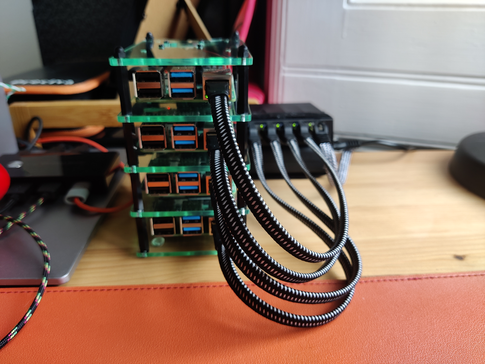

For starters, follow the instructions for your case and/or rack. [Here is the guide](https://thepihut.com/blogs/raspberry-pi-tutorials/cluster-case-assembly-instructions) for the cluster case linked in the [Components](/hardware/components) section.
Note that if you're using the additional [fan controllers](https://thepihut.com/products/fan-controller-for-raspberry-pi?variant=39578362577091), you might need to make space for them by either using a few _mm_ taller standoffs, or securing the fans using only three screws.

When the case is assembled, connect the switch using 4 ethernet cables.
One of the slots on the switch will be free (if you got the 5 port kind), this is where we will connect it to the local network.
Then use 4 USB-C cables to power the Raspberry Pis.

If you're using the same switch and power adapter as described in the [Components](/hardware/components/) section, you can get a USB to "3.5mm x 1.35mm barrel connector" to power the switch (as shown on the image below).
This will let you use only one mains connection to power the whole thing.

Now all you need to do is to plug it in and you're done with the hardware!
You might want to compactify the cluster with some zipties or velcro though.

